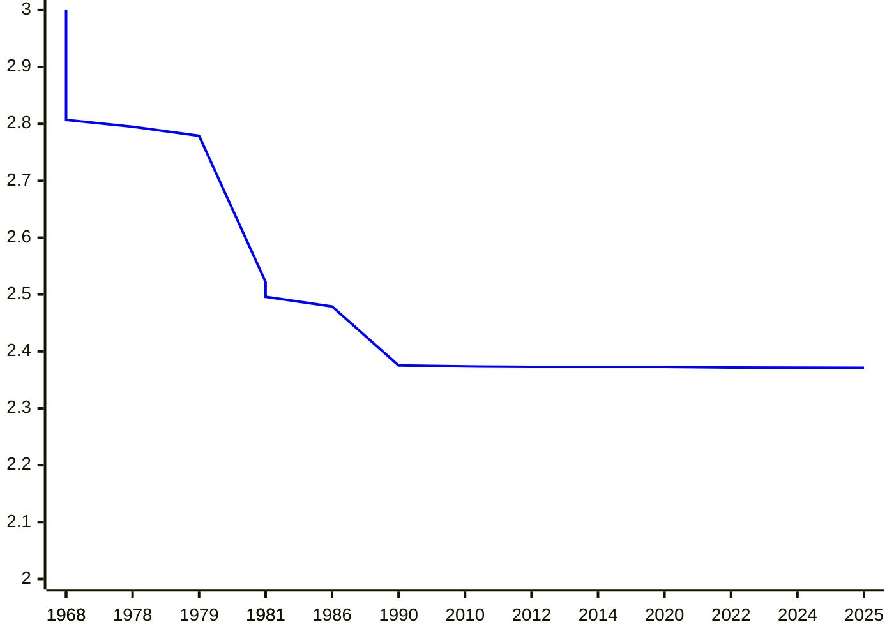

# An Optimal Error-Correcting Reduction for Matrix Multiplication

[**Nobutaka Shimizu**](https://sites.google.com/view/nobutaka-shimizu/home) (Institute of Science Tokyo)

joint work with Shuichi Hirahara (National Institute of Informatics)

  <QRCode value="https://nobutakashimizu.github.io/icalp25_slide/1" :size="120" render-as="svg"/>

[proceedings link](https://drops.dagstuhl.de/entities/document/10.4230/LIPIcs.ICALP.2025.97)

[ECCC link](https://eccc.weizmann.ac.il/report/2025/031/)

:: note ::

  ICALP 2025, Denmark, Aarhus

---
layout: top-title
color: amber-light
---

::title::

# Matrix Multiplication

::content::

  <QRCode value="https://nobutakashimizu.github.io/icalp25_slide/1" :size="80" render-as="svg"/>

Given two $n\times n$ matrices $A,B\in\F^{n\times n}$, compute $AB$.

| year | $\omega$ |  authors |
|:--:|:--|:--|
| 1968 | $2.807$ | [Strassen](https://link.springer.com/article/10.1007/BF02165411) |
| 1978 | $2.795$ | [Pan](https://ieeexplore.ieee.org/document/4567976) |
| 1979 | $2.779$ | [Bini, Capovani, Romani, Lotti](https://www.sciencedirect.com/science/article/pii/0020019079901133) |
| 1981 | $2.522$ | [Schönhage](https://epubs.siam.org/doi/10.1137/0210032) |
| 1981 | $2.517$ | [Romani](https://epubs.siam.org/doi/10.1137/0211020) |

|year | $\omega$ | authors |
|:--:|:--|:--|
| 1981 | $2.496$ | [Coppersmith, Winograd](https://ieeexplore.ieee.org/document/4568320) |
| 1986 | $2.479$ | [Strassen](https://ieeexplore.ieee.org/document/4568194) |
| 1990 | $2.3755$ | [Coppersmith, Winograd](https://www.sciencedirect.com/science/article/pii/S0747717108800132?via%3Dihub) |
| 2010 | $2.3737$ | [Stothers](https://era.ed.ac.uk/handle/1842/4734) |
| 2012 | $2.3729$ | [Williams](https://dl.acm.org/doi/10.1145/2213977.2214056) |

| year | $\omega$ | authors |
|:--:|:--|:--|
| 2014 | $2.3728639$ | [Le Gall](https://dl.acm.org/doi/10.1145/2608628.2627493) |
| 2020 | $2.3728596$ | [Alman, Williams](https://theoretics.episciences.org/14213) |
| 2022 | $2.371866$ | [Duan, Wu, Zhou](https://ieeexplore.ieee.org/document/10353208) |
| 2024 | $2.371552$ | [Williams, Xu, Xu, and Zhou](https://epubs.siam.org/doi/10.1137/1.9781611977912.134) |
| 2025 | $2.371339$ | [Alman, Duan, Williams, Xu, Xu, and Zhou](https://epubs.siam.org/doi/10.1137/1.9781611978322.63) |

---
layout: top-title
color: amber-light
---

::title::

# Computational Complexity of Matrix Multiplication

::content::

  <QRCode value="https://nobutakashimizu.github.io/icalp25_slide/1" :size="80" render-as="svg"/>

When can we get an $O(n^2)$-time algorithm?🧐

---
layout: top-title
color: amber-light
---

::title::

# Computational Complexity of Matrix Multiplication

::content::

  <QRCode value="https://nobutakashimizu.github.io/icalp25_slide/1" :size="80" render-as="svg"/>

  

  

  In **5147**, there will be an $O(n^2)$-time algorithm.

  (if the current improvement rate of 0.0046 / 35 years continues)

  

  

  

  

  

<figure>

</figure>

---
layout: top-title
color: amber-light
---

::title::

# Average-Case Approximate Matrix Multiplication

::content::

  <QRCode value="https://nobutakashimizu.github.io/icalp25_slide/1" :size="80" render-as="svg"/>

Given two **random** matrices $A,B\sim\F^{n\times n}$ as input, compute any matrix $C\in\F^{n\times n}$ that agrees with $AB$ on at least $\textcolor{c2185b}{\alpha}\cdot n^2$ entries.

<v-clicks>

- $\alpha = 1$: the usual (average-case) matrix mult

- $\alpha = \frac{1}{\abs{\F}}$ is easy (random matrix)

- An algorithm is non-trivial if $\alpha \ge \frac{1}{\abs{\F}} + \textcolor{c2185b}{\varepsilon}$ (better than random guess)

  - This paper: $\abs{\F}$ is small (indeed constant size field)

</v-clicks>

---
layout: top-title
color: amber-light
---

::title::

# Practical Situation: low-energy matrix multiplication

::content::

  <QRCode value="https://nobutakashimizu.github.io/icalp25_slide/1" :size="80" render-as="svg"/>

- Electricity consumption increases due to AI techniques relying on large-scale matrix mult on GPU (e.g., computing gradient) <a class="cite-reference" href="https://www.iea.org/reports/electricity-2024/executive-summary"> \[International Energy Agency\] </a>

<v-click>

- Low-energy matrix mult algorithms using **physical devices**
  - Water flow <a href="https://drops.dagstuhl.de/entities/document/10.4230/LIPIcs.ITCS.2024.96" class="cite-reference">\[Valinat, ITCS'24\]</a>, thermodynamic systems <a href="https://openreview.net/forum?id=6flkWTzK2H" class="cite-reference">\[Coles et al, NeurIPS'23 (workshop)\]</a>, optical devices <a href = "https://www.nature.com/articles/s41377-022-00717-8" class="cite-reference">\[Zhou et al, Light: Science & Applications'22\]</a>

</v-click>

<v-clicks>

- These algorithms may have **errors** due to white noise in physical systems
  - Physical devices solve **approximate** matrix mult

  

  

  This paper presents how to correct such error using **expanders**!😄

  

  

  

  {width="70%"}

  

</v-clicks>

---
layout: top-title
color: amber-light
---

::title::

# Problem Setting (Formal)

::content::

  <QRCode value="https://nobutakashimizu.github.io/icalp25_slide/1" :size="80" render-as="svg"/>

The **agreement** of two matrices $C,D\in\mathbb{F}^{n\times n}$ is defined as

$$
  \begin{align*}
    \agr(C,D) &:= \Pr_{i,j\sim[n]}[C(i,j) = D(i,j)].
  \end{align*}
$$

An algorithm $M$ is said to have **average agreement $\alpha$** if
$$
\Exp_{A,B\sim\mathbb{F}^{n\times n}}[\agr(M(A,B),AB)] = \Pr_{\substack{A,B\sim\F^{n\times n}\\ i,j\sim[n]}}[M(A,B)_{i,j}=(AB)_{i,j}]\ge \alpha.
$$
 
 

**Our Prototype Result**: 

If $\exists$ algo with agreement $\alpha$, then $\exists$ algo with agreement $1$ with similar running time.

---
layout: top-title
color: amber-light
---

::title::

# Previous Results

::content::

  <QRCode value="https://nobutakashimizu.github.io/icalp25_slide/1" :size="80" render-as="svg"/>

- Worst-case to average-case reductions for **exact** matrix mult <a href="https://www.sciencedirect.com/science/article/pii/002200009390044W?via%3Dihub" class="cite-reference">\[Blum, Luby, Rubinfeld, JCSS'93\]</a>, <a href="https://dl.acm.org/doi/10.1145/3519935.3520041" class="cite-reference">\[Asadi, Golovnev, Gur, Shinkar, STOC'22\]</a>, <a href="https://dl.acm.org/doi/10.1145/3564246.3585189" class="cite-reference">\[Hirahara, S., STOC'23\]</a>

<v-clicks>

- The first **approximate** matrix mult result: <a class="cite-reference" href="https://drops.dagstuhl.de/entities/document/10.4230/LIPIcs.APPROX/RANDOM.2024.34">\[Gola, Shinkar, Singh, RANDOM'24\]</a>
  - $\exists$ algo with $\alpha>\frac{8}{9}$ $\Rightarrow$ $\exists$ algo with $\alpha=1$
  - open question: $\alpha\ge \frac{1}{\abs{\F}}+\varepsilon$?

- Our previous work <a class="cite-reference" href="https://dl.acm.org/doi/10.1145/3717823.3718244">\[Hirahara, S., STOC'25\]</a>
  - $\exists$ algo with $\alpha\ge \frac{\textcolor{c2185b}{2}}{\abs{\F}}+\varepsilon$ $\Rightarrow$ $\exists$ algo with $\alpha=1$
    - does not work for $\F=\F_2$
  - $\exists$ **circuit** with $\alpha\ge\frac{\textcolor{c2185b}{1}}{\abs{\F}}+\varepsilon$ $\Rightarrow$ $\exists$ **circuit** with $\alpha=1$
    - **nonuniform**: For every input size $n$, there **exists** a circuit $C_n$ that solves multiplication
</v-clicks>

---
layout: top-title
color: amber-light
---

::title::

# Main Result

::content::

  <QRCode value="https://nobutakashimizu.github.io/icalp25_slide/1" :size="80" render-as="svg"/>

Is there a **uniform reduction** that works for $\alpha\ge\frac{\textcolor{c2185b}{1}}{\abs{\F}}+\varepsilon$?

<v-clicks>

Suppose $\abs{\F}$ is prime.
If there exists a $T(n)$-time algorithm with average agreement **$\alpha\ge \frac{1}{\abs{\F}}+\varepsilon$**,
then there exists an $2^{2^{\poly(\abs{\F}/\varepsilon)}}\cdot T(n)\cdot \polylog(n)$-time algorithm with average agreement $1$.

- Resolves the open question of <a class="cite-reference" href="https://drops.dagstuhl.de/entities/document/10.4230/LIPIcs.APPROX/RANDOM.2024.34">\[Gola, Shinkar, Singh, RANDOM'24\]</a>
- Independently, <a class="cite-reference" href="https://arxiv.org/abs/2502.13065">\[Vaikuntanathan, Zamir, '25\]</a> showed the same result (completely different approach)
  - conditional (under the hardness assumption of **Learning with Error**)
  - much better overhead: **$\polylog(\abs{\F}/\varepsilon)$**

</v-clicks>

---
layout: section
color: amber-light
---

# Idea

### (for worst-case-to-worst-case reduction)

---
layout: top-title
color: amber-light
---

::title::

# Idea: Matrix Encoding

::content::

  <QRCode value="https://nobutakashimizu.github.io/icalp25_slide/1" :size="80" render-as="svg"/>

<v-click>

Construct $A'$ and $B'$ such that $A'\cdot B' = \Enc(AB)$.

</v-click>

---
layout: top-title
color: amber-light
---

::title::

# Error-Correcting Codes

::content::

  <QRCode value="https://nobutakashimizu.github.io/icalp25_slide/1" :size="80" render-as="svg"/>

- An **encoding function** is a linear map $\Enc\colon z \mapsto Lz$ for a matrix $L\in\F^{N\times n}$
  - A **code** is $\calC=\Enc(\F^n)\subseteq \F^N$
  

    
  
<v-clicks>
  
- $r=n/N$: **rate** of $\calC$ (larger $r$ is better)
- **distance of vectors**: fractional Hamming distance, i.e., $\dist(x,y):=\Pr_{i\sim[N]}[x_i\ne y_i]$
  - $\delta=\min_{x\ne y\in \calC} \dist(x,y)$: minimum distance of code $\calC$

</v-clicks>

---
layout: top-title
color: amber-light
---
::title::

# Error-Correcting Codes

::content::

  <QRCode value="https://nobutakashimizu.github.io/icalp25_slide/1" :size="80" render-as="svg"/>

A code $\calC\subseteq\F^N$ is **$(\rho,L)$-list-decodable** if $\abs{\calC \cap \ball(y,\rho)}\le L$ for any $y\in\F^N$.

- $\ball(x,\rho)=\{ y\in\F^N \colon \dist(x,y)\le\rho \}$ : Hamming ball.

  

<v-clicks>

- We assume $L=O(1)$ (independent of $N$)

- $L=1$ : unique decoding
  - we must have $\rho< 1/2$ (unless $\abs{\calC}=1$)

- Special case of list-recovery

</v-clicks>

---
layout: top-title
color: amber-light
---
::title::
# Previous Technique \[Hirahara, S., STOC'25\]
::content::

  <QRCode value="https://nobutakashimizu.github.io/icalp25_slide/1" :size="80" render-as="svg"/>

<v-click>

- If $z\mapsto Lz$ is list-decodable within radius $1-\alpha$, then $X\mapsto L^\top X L$ is list-decodable within radius $1-\textcolor{c2185b}{2\alpha}$ <a href="https://epubs.siam.org/doi/10.1137/090778274" class="cite-reference">\[Gopalan, Guruswami, Raghavendra, SICOMP'11\]</a>
  - the main reason for $\alpha \ge \frac{\textcolor{c2185b}{2}}{\abs{\F}}+\varepsilon$ in the previous work

</v-click>

---
layout: top-title
color: amber-light
---
::title::
# New Reduction (Sketch)
::content::

  <QRCode value="https://nobutakashimizu.github.io/icalp25_slide/1" :size="80" render-as="svg"/>

# our solution: ex**pand**er graph

---
layout: top-title
color: amber-light
---
::title::
# Expander-Walk Code
::content::

  <QRCode value="https://nobutakashimizu.github.io/icalp25_slide/1" :size="80" render-as="svg"/>

Let $G=(V,E)$ be a $d$-regular **spectral expander** and 
$W\subseteq V^\ell$ be the set of all walks of length $\ell-1$ on $G$.
**$\ell$-wise direct sum encoding over $G$** is function $\Enc\colon \F^V\to\F^W$ defined by

$$
  \Enc(x) = \rbra{ x(v_0)+x(v_1)+\dots+x(v_{\ell-1}) }_{(v_0,v_1,\dots,v_{\ell-1})\in W }
$$

- appeared in <a href="https://dl.acm.org/doi/10.1145/3055399.3055408" class="cite-reference">\[Ta-Shma, 2017\]</a>
- efficient approximate list-decoding <a href="https://drops.dagstuhl.de/entities/document/10.4230/LIPIcs.APPROX/RANDOM.2023.60" class="cite-reference">\[Jeronimo, Srivastava, Tulsiani, STOC'21\]</a>, <a href="https://drops.dagstuhl.de/entities/document/10.4230/LIPIcs.APPROX/RANDOM.2023.60" class="cite-reference">\[Jeronimo, RANDOM'23\]</a>

---
layout: top-title
color: amber-light
---
::title::
# Expander-Walk Code
::content::

  <QRCode value="https://nobutakashimizu.github.io/icalp25_slide/1" :size="80" render-as="svg"/>

Let $G=(V,E)$ be a $d$-regular **spectral expander** and 
$W\subseteq V^\ell$ be the set of all walks of length $\ell-1$ on $G$.
**$\ell$-wise direct sum encoding over $G$** is function $\Enc\colon \F^V\to\F^W$ defined by

$$
  \Enc(x) = \rbra{ x(v_0)+x(v_1)+\dots+x(v_{\ell-1}) }_{(v_0,v_1,\dots,v_{\ell-1})\in W }
$$

- appeared in <a href="https://dl.acm.org/doi/10.1145/3055399.3055408" class="cite-reference">\[Ta-Shma, 2017\]</a>
- efficient approximate list-decoding <a href="https://drops.dagstuhl.de/entities/document/10.4230/LIPIcs.APPROX/RANDOM.2023.60" class="cite-reference">\[Jeronimo, Srivastava, Tulsiani, STOC'21\]</a>, <a href="https://drops.dagstuhl.de/entities/document/10.4230/LIPIcs.APPROX/RANDOM.2023.60" class="cite-reference">\[Jeronimo, RANDOM'23\]</a>

---
layout: top-title
color: amber-light
---
::title::
# Lifting
::content::

  <QRCode value="https://nobutakashimizu.github.io/icalp25_slide/1" :size="80" render-as="svg"/>

<figcaption style="text-align: center; font-size: 0.8em; color: #666;">

$A'$ becomes an $\abs{W}\times kn$ matrix. The $\mathbf{i}=(i_1,\dots,i_k)$-th row contains the $i_1$-th row vector, $i_2$-th row vector, ... of $A$.  
$B'$ is constructed by applying the same operation to $B$ with rows and columns interchanged.

</figcaption>

---
layout: top-title
color: amber-light
---
::title::
# Product of Lifting
::content::

  <QRCode value="https://nobutakashimizu.github.io/icalp25_slide/1" :size="80" render-as="svg"/>

{width=90%}

- The $(\mathbf{i},\mathbf{j})$-th entry of $A'\cdot B'$ equals $(AB)_{i_1,j_1} + \dots + (AB)_{i_k,j_k}$ -> "XOR" of $k$ entries of $AB$
- Sum along the walk $(i_1,j_1)\to \dots \to (i_k,j_k)$ on the tensor product $G^2$.

$A'B'$ is encoding of $AB$ using the **expander-walk code** on $G^2$.

---
layout: top-title
color: amber-light
---
::title::
# Our Reduction (reminder)
::content::

  <QRCode value="https://nobutakashimizu.github.io/icalp25_slide/1" :size="80" render-as="svg"/>

- From 99\% to 100\%:  <a class="cite-reference" href="https://drops.dagstuhl.de/entities/document/10.4230/LIPIcs.APPROX/RANDOM.2024.34">\[Gola, Shinkar, Singh, RANDOM'24\]</a>

- Worst-case-to-average-case reduction: modification of this (the most technical point)

---
layout: top-title
color: amber-light
---
::title::
# Summary & Future Direction
::content::

  <QRCode value="https://nobutakashimizu.github.io/icalp25_slide/1" :size="80" render-as="svg"/>

Optimal **worst-case-to-average-case** and **exact-to-approximate** reduction for matrix mult.

 

# Future Directions

- Reduce the hidden constant **$2^{2^{\poly(p/\varepsilon)}}$**?
  - $\poly(p/\varepsilon)$ is possible for nonuniform reductions <a class="cite-reference" href="https://dl.acm.org/doi/10.1145/3717823.3718244">\[Hirahara, S., STOC'25\]</a> or conditional reductions <a class="cite-reference" href="https://arxiv.org/abs/2502.13065">\[Vaikuntanathan, Zamir, '25\]</a>
- matrix over **$\Real$** or **$\mathbb{Q}$**?
  - Easy to compute $n$ entries (i.e., agreement $\alpha =1/n$). Can we do larger $\alpha$?
  - or: approximation-to-exact reduction within worst-case complexity?
  - ECC over alphabet $\mathbb{Q}$?

<v-click>

  

    Thank you 😊
  

</v-click>

