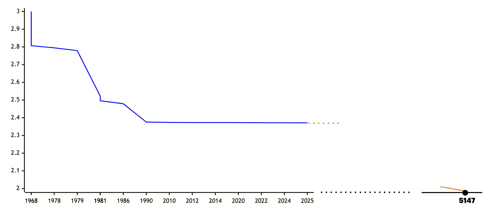

# An Optimal Error-Correcting Reduction for Matrix Multiplication

- Shuichi Hirahara (National Institute of Informatics)
- [**Nobutaka Shimizu**](https://sites.google.com/view/nobutaka-shimizu/home) (Institute of Science Tokyo)

  <QRCode value="https://nobutakashimizu.github.io/stoc25_slide/" :size="120" render-as="svg"/>

  $\uparrow$ [slide (github page)](https://nobutakashimizu.github.io/stoc25_slide/)

  [ECCC link](https://eccc.weizmann.ac.il/report/2025/031/)

:: note ::

  @ICALP 2025

---
layout: top-title
color: amber-light
---

::title::

# Matrix Multiplication

::content::

Given two matrices $A, B \in \F^{n\times n}$, compute their product $AB$ (over a finite field $\F$).

<v-click>

| year | $\omega$ |  authors |
|:--:|:--|:--|
| 1968 | $2.807$ | [Strassen](https://link.springer.com/article/10.1007/BF02165411) |
| 1978 | $2.795$ | [Pan](https://ieeexplore.ieee.org/document/4567976) |
| 1979 | $2.779$ | [Bini, Capovani, Romani, Lotti](https://www.sciencedirect.com/science/article/pii/0020019079901133) |
| 1981 | $2.522$ | [Schönhage](https://epubs.siam.org/doi/10.1137/0210032) |
| 1981 | $2.517$ | [Romani](https://epubs.siam.org/doi/10.1137/0211020) |

|year | $\omega$ | authors |
|:--:|:--|:--|
| 1981 | $2.496$ | [Coppersmith, Winograd](https://ieeexplore.ieee.org/document/4568320) |
| 1986 | $2.479$ | [Strassen](https://ieeexplore.ieee.org/document/4568194) |
| 1990 | $2.3755$ | [Coppersmith, Winograd](https://www.sciencedirect.com/science/article/pii/S0747717108800132?via%3Dihub) |
| 2010 | $2.3737$ | [Stothers](https://era.ed.ac.uk/handle/1842/4734) |
| 2012 | $2.3729$ | [Williams](https://dl.acm.org/doi/10.1145/2213977.2214056) |

| year | $\omega$ | authors |
|:--:|:--|:--|
| 2014 | $2.3728639$ | [Le Gall](https://dl.acm.org/doi/10.1145/2608628.2627493) |
| 2020 | $2.3728596$ | [Alman, Williams](https://theoretics.episciences.org/14213) |
| 2022 | $2.371866$ | [Duan, Wu, Zhou](https://ieeexplore.ieee.org/document/10353208) |
| 2024 | $2.371552$ | [Williams, Xu, Xu, and Zhou](https://epubs.siam.org/doi/10.1137/1.9781611977912.134) |
| 2025 | $2.371339$ | [Alman, Duan, Williams, Xu, Xu, and Zhou](https://epubs.siam.org/doi/10.1137/1.9781611978322.63) |

</v-click>

---
layout: top-title
color: amber-light
---

::title::

# Computational Complexity of Matrix Multiplication

::content::

When can we get an $O(n^2)$-time algorithm?🧐

<v-click>

</v-click>

---
layout: top-title
color: amber-light
---

::title::

# Computational Complexity of Matrix Multiplication

::content::

😭😭😭😭 We need to wait **3122 years** 😭😭😭😭

if the current improvement rate of 0.0046 / 35 years continues

<figure>

</figure>

---
layout: top-title
color: amber-light
---

::title::

# Average-Case Approximate Matrix Multiplication

::content::

Given two **random** matrices $A,B\sim\F^{n\times n}$ as input, compute any matrix $C\in\F^{n\times n}$ that agrees with $AB$ on at least $\textcolor{c2185b}{\alpha}\cdot n^2$ entries.

<v-clicks>

- $\alpha = 1$: the usual (average-case) matrix mult

- $\alpha = \frac{1}{\abs{\F}}$ and $\alpha=\frac{1}{n}$ are easy (random matrix or compute $n$ entries)

- An algorithm is non-trivial if $\alpha \ge \frac{1}{\abs{\F}} + \textcolor{c2185b}{\varepsilon}$ (better than random guess)

</v-clicks>

---
layout: top-title
color: amber-light
---

::title::

# Practical Situation: low-energy matrix multiplication

::content::

- AI rely on large-scale matrix mult on GPU
  - According to [International Energy Agency](https://www.iea.org/reports/electricity-2024/executive-summary), in 2026, **electricity consumption** from data centres, AI and the cryptocurrency could be the same as the total electricity consumption of Japan.

<v-click>

- Implementation of matrix mult algorithms using **physical devices**
  - Water flow <a href="https://drops.dagstuhl.de/entities/document/10.4230/LIPIcs.ITCS.2024.96" class="cite-reference">\[Valinat, ITCS'24\]</a>, thermodynamic systems <a href="https://openreview.net/forum?id=6flkWTzK2H" class="cite-reference">\[Coles et al, NeurIPS'23 (workshop)\]</a>, optical devices <a href = "https://www.nature.com/articles/s41377-022-00717-8" class="cite-reference">\[Zhou et al, Light: Science & Applications'22\]</a>
  - [post](https://www.quantamagazine.org/ai-needs-enormous-computing-power-could-light-based-chips-help-20240520/) by Quanta Magazine

</v-click>

<v-clicks>

- These algorithms may have **errors** due to white noise in physical systems
  - Physical devices solve **approximate** matrix mult

We show how to **correct** the errors in average-case approximate matrix mult algorithms.

</v-clicks>

---
layout: top-title
color: amber-light
---

::title::

# Problem Setting (Formal)

::content::

The **agreement** of two matrices $C,D\in\mathbb{F}^{n\times n}$ is defined as

$$
  \begin{align*}
    \agr(C,D) &:= \Pr_{i,j\sim[n]}[C(i,j) = D(i,j)].
  \end{align*}
$$

An algorithm $M$ is said to have **average agreement $\alpha$** if
$$
\Exp_{A,B\sim\mathbb{F}^{n\times n}}[\agr(M(A,B),AB)] = \Pr_{\substack{A,B\sim\F^{n\times n}\\ i,j\sim[n]}}[M(A,B)_{i,j}=(AB)_{i,j}]\ge \alpha.
$$
 
 

<v-clicks>

- $\alpha=1$ means that $M$ computes $AB$ exactly for any input $A,B$.
- Why **average-case**?🤔 -> we can estimate **$\alpha$** in $\widetilde{O}(n^2)$ time by random sampling🤓
  - Choose $A,B,i,j$ and check whether $M(A,B)_{i,j}=(AB)_{i,j}$

</v-clicks>

---
layout: top-title
color: amber-light
---

::title::

# Previous Results

::content::

- Worst-case to average-case reductions for **exact** matrix mult
  - <a href="https://www.sciencedirect.com/science/article/pii/002200009390044W?via%3Dihub" class="cite-reference">\[Blum, Luby, Rubinfeld, JCSS'93\]</a>, <a href="https://dl.acm.org/doi/10.1145/3519935.3520041" class="cite-reference">\[Asadi, Golovnev, Gur, Shinkar, STOC'22\]</a>, <a href="https://dl.acm.org/doi/10.1145/3564246.3585189" class="cite-reference">\[Hirahara, S., STOC'23\]</a>

<v-clicks>

- The first **approximate** matrix mult result: <a class="cite-reference" href="https://drops.dagstuhl.de/entities/document/10.4230/LIPIcs.APPROX/RANDOM.2024.34">\[Gola, Shinkar, Singh, RANDOM'24\]</a>
  - Similar result for $\F=\F_2$ (under one-sided error setting)
  - $\exists$ algo with $\alpha>\frac{8}{9}$ $\Rightarrow$ $\exists$ algo with $\alpha=1$

- Improvement: <a class="cite-reference" href="https://dl.acm.org/doi/10.1145/3717823.3718244">\[Hirahara, S., STOC'25\]</a>
  - If $\abs{\F}>n/\alpha^2$, $\exists$ algo with average-agreement $\alpha$ $\Rightarrow$ $\exists$ algo with average-agreement $1$.
  - If $\abs{\F}=O(1)$, $\exists$ algo with average-agreement $\frac{\textcolor{c2185b}{2}}{\abs{\F}}+\varepsilon$ $\Rightarrow$ $\exists$ algo with average-agreement $1$
  - If $\abs{\F}=O(1)$, $\exists$ **circuit** with average-agreement $\frac{\textcolor{c2185b}{1}}{\abs{\F}}+\varepsilon$ $\Rightarrow$ $\exists$ **circuit** with average-agreement $1$
    - **nonuniform**: for every $n$, there is a reduction $R_n$ such that ...
</v-clicks>

---
layout: top-title
color: amber-light
---

::title::

# Main Result

::content::

Is there a **uniform reduction** that works for $\alpha\ge\frac{\textcolor{c2185b}{1}}{\abs{\F}}+\varepsilon$?

<v-clicks>

Suppose $\abs{\F}$ is prime.
If there exists a $T(n)$-time algorithm with average agreement **$\alpha\ge \frac{1}{\abs{\F}}+\varepsilon$**,
then there exists an $2^{2^{\poly(\abs{\F}/\varepsilon)}}\cdot T(n)\cdot \polylog(n)$-time algorithm with average agreement $1$.

- Independently, <a class="cite-reference" href="https://arxiv.org/abs/2502.13065">\[Vaikuntanathan, Zamir, '25\]</a> showed the same result (completely different approach)
  - conditional (under the hardness of **Learning with Error**)
  - much better overhead: **$\polylog(\abs{\F}/\varepsilon)$**

</v-clicks>

---
layout: section
color: amber-light
---

# Proof Idea

---
layout: top-title
color: amber-light
---

::title::

# Idea: Matrix Encoding

::content::

$M$: worst-case approximation algorithm such that $\agr(M(A,B),AB)\ge\alpha$ for any $A,B\in\F^{n\times n}$

<v-click>

Construct $A'$ and $B'$ such that $A'\cdot B'$ is the encoding of $AB$.

</v-click>

---
layout: top-title
color: amber-light
---

::title::

# Error-Correcting Codes

::content::

- An **encoding function** is a linear map $\Enc\colon \F^n\to\F^N$
  - $\Enc(z)=Lz$ for $L\in\F^{N\times n}$
  - A **code** is $\calC=\Enc(\F^n)\subseteq \F^N$
  

    
  
<v-clicks>
  
- $r=n/N$: **rate** of $\calC$ (larger $r$ is better)
- **distance**: fractional Hamming distance, i.e., $\dist(x,y):=\Pr_{i\sim[N]}[x_i\ne y_i]$

</v-clicks>

---
layout: top-title
color: amber-light
---
::title::

# Error-Correcting Codes

::content::

A code $\calC\subseteq\F^N$ is **$(\rho,L)$-list-decodable** if $\abs{\calC \cap \ball(y,\rho)}\le L$ for any $y\in\F^N$.

- $\ball(x,\rho)=\{ y\in\F^N \colon \dist(x,y)\le\rho \}$ : Hamming ball.

  

<v-click>

What we need: **$\widetilde{O}(N)$-time list-decodable code**

</v-click>

---
layout: top-title
color: amber-light
---
::title::
# Previous Technique \[Hirahara, S., STOC'25\]
::content::

The **tensor code** with respect to $\Enc\colon x\mapsto Lx$ is the code $\calC^2\subseteq\F^{N\times N}$ specified by the encoding function $\Enc'\colon \F^{n\times n} \to \F^{N\times N}$ defined by
  $$ \Enc'\colon X \mapsto L X L^\top. $$

- original code is $(1-\textcolor{c2185b}{\alpha},O(1))$-list-decodable $\Rightarrow$ tensor code is $(1-\textcolor{c2185b}{2\alpha},O(1))$-list-decodable <a href="https://epubs.siam.org/doi/10.1137/090778274" class="cite-reference">\[Gopalan, Guruswami, Raghavendra, SICOMP'11\]</a>.

  - the non-optimality of $\alpha\ge \frac{\textcolor{c2185b}{2}}{\abs{\F}}+\varepsilon$ in our uniform reduction is due to this loss

---
layout: top-title
color: amber-light
---
::title::
# Previous Technique \[Hirahara, S., STOC'25\]
::content::

- Product = Tensor encoding of $AB$
- We can identify $AB$ from the list by **Freivalds' randomized verification**

---
layout: top-title
color: amber-light
---
::title::
# New Reduction
::content::

- The loss of $2$-factor in $\alpha$ is due to decoding tensor codes
- key idea: avoid tensor code using **expander-walk lifting**

---
layout: top-title
color: amber-light
---
::title::
# Worst-Case to Average-Case Reduction
::content::

- Issue: even if $A,B\sim\F^{n\times n}$, their encodings $LA,BL^\top$ are **not** uniform

- **Idea**: divide $LA, BL^\top$ into small blocks such that each block is uniform
  - technical part: way to compute such division

<figcaption style="text-align: center; font-size: 0.8em; color: #666;">

We divide $LA,BL^\top$ such that the marginal distribution of each $A_i,B_j$ is uniform.

</figcaption>

---
layout: top-title
color: amber-light
---
::title::
# Summary
::content::

Optimal **worst-case-to-average-case** and **exact-to-approximate** reduction for matrix mult.

- Open Question
  - Reduce the hidden constant **$2^{2^{\poly(p/\varepsilon)}}$**?
  - matrix over **$\Real$** or **$\mathbb{Q}$**?
    - how to formalize? (ideas welcome!!!)

- Our future plan
  1. Deal with real numbers
  2. Implement (perhaps using physical devices)
  <v-click>3. Sell it to NVIDIA or OpenAI </v-click>

<QRCode value="https://nobutakashimizu.github.io/stoc25_slide/" :size="70" render-as="svg"/>

Thank you!

